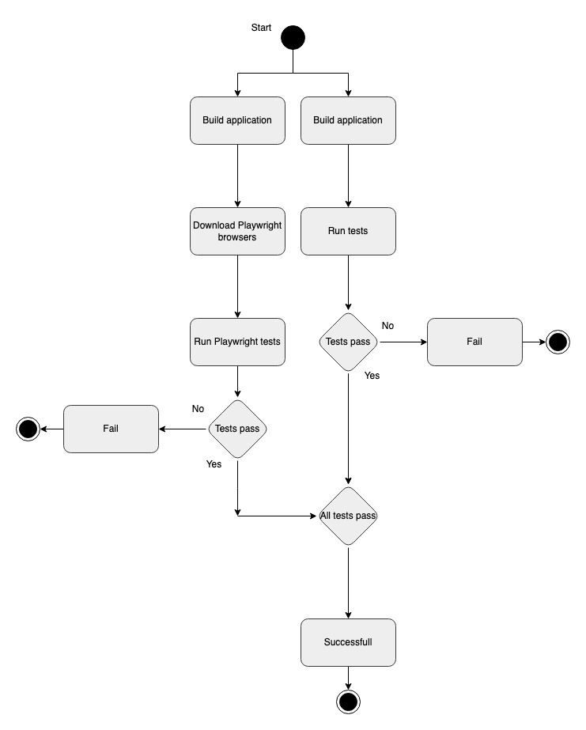
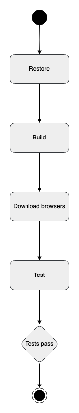

## Design and architecture

### Domain model

### Architecture — In the small

Below a diagram can be seen, showing the onion architecture of the Chirp program. Were the outer circles depend on the inner circles:

{ width=50% }

In the center of the onion one finds Chirp Core, this is were the most primitive code lies, like objects and interfaces.

One step out of Chirp Core, one finds Chirp Infrastructure. This is were the handling of the database is done, this includes retrieving, deleting and updating data. Defining the database and giving it some initial data is also done in Chirp Infrastructure.

In the third layer of the onion, Chirp Web lies. This is were the webpage HTML is found, along with all the styling. The API which the web pages communicate with lies here as well.

Lastly there is the outer layer, naturally here the test lay. The test suit includes Unit-, integration- and end2end test. The end2end test are done using Playwright.

### Architecture of deployed application

### User activities

The goal of this chapter is to show some core interactions from both an **unauthenticated user** and **authenticated user**. We make use of UML activity diagrams, these will visualize the states triggered by a user's actions.

First off we want to show what an unauthenticated user can do, and how the journey is for such a user to register.

{ width=50% }

This diagram show that a user can authenticate with both Email, and GitHub. Also, if you like a cheep from a user on the public timeline. It will simply not like it, but instead put you on the register page. Registering this way will give the same result as just navigating to the register page using the navigation bar.

When you are authenticated / logged in, we have 4 primary actions a user can do, respectively: Cheep, Like, Follow and Delete the account from the Chirp service.

The process of cheeping is shown in this diagram:

{ width=50% }

A cheep is valid if its length, as show in the diagram, is between 0 and up to and including 160 characters. If you were to click the share button, with and empty text field, a warning will pop up. A warning pop up won't explicitly be shown to the user for cheeps longer than 160 characters, we simply show the length counter on screen, and don't allow for more characters, in both front- and backend.

The users also need to like cheeps, for that action we have this diagram:

{ width=50% }

The 'heart' button we have besides each cheep is essentially a toggle for likes on the given cheep. And as showed in the diagram, each user can only like any given cheep once. It is important to note, as of now the liking of a cheep will result in the page redirecting you to the root page (page 1), even though you might be on for instance page 6. There is an obvious room for improvement, and the task is currently a task in the project board.

Next up we want to show the journey of a user following another user.

{ width=50% }

The journey of following a user, is close to the same as liking cheeps, as both are 'toggles'. The only difference is that we decided to show the newly followed users profile after the follow action. Which eliminates the issue we are having with liking cheeps far down on the public timeline, and wanting to scroll beyond that point afterwards. This does then create the issue with wanting to continue scrolling after following.
But this navigation to the private timeline of the newly followed user, is a conscious decision.

Lastly it is important for us to show how the user can delete, and see the data we have gathered.

{ width=50% }

The linear diagram is pretty much self-explanatory, but we feel it is important to show either way, since this is last key feature for a user to experience.

### Sequence of functionality/calls trough _Chirp!_

## Process

### Build, test, release, and deployment

{ width=50% }

some text

{ height=25% }

some text

{ height=25% }

some text

{ height=25% }

some text

### Team work

### How to make _Chirp!_ work locally

### How to run test suite locally

## Ethics

### License

We decided to go ahead with and use the **MIT License**

### LLMs, ChatGPT, CoPilot, and others

In the development of our project we used ChatGPT, and when we did so, we made sure to add ChatGPT as a co-author in our git commit message like so:

`ChatGPT <>`

ChatGPT was very helpful when used to create simple code parts and debug some.
On the other hand the ChatGPT was not helpful with complex code questions. Therefore we ended up finding it mostly useful for us to understand parts of the code and guide us on where to start on complex tasks.

However we also experienced some negatives when using ChatGPT. It could sometimes go in a spiral, in cases like this we would look at the slides and on the web for help.
We also gave Gemini some use sometimes when ChatGPT was not helpful, we did however never use any of the provided code, so it never got to be a co-author.

For the most part the use of LLMs sped up our development, however some times the were send into a spiral and hallucinated, which sometimes could confuse us more.
So we experienced the limitations of LLMs and got to learn more on know how to use them more efficiently.
