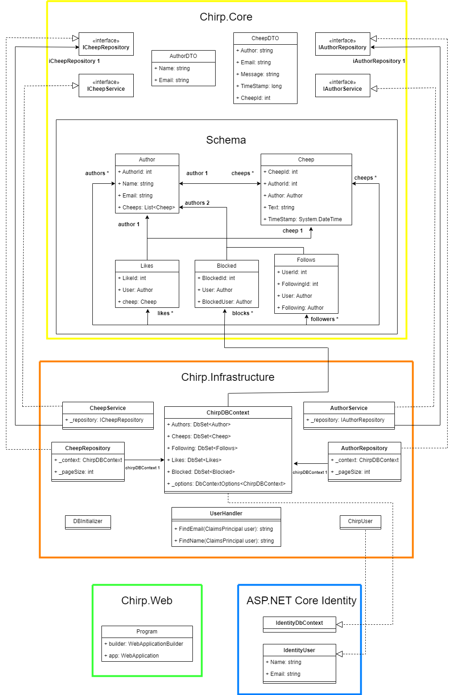
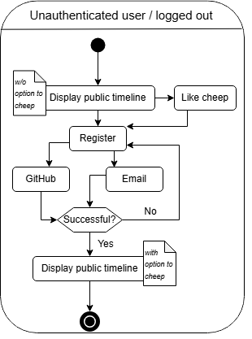

## Design and architecture

### Domain model

{ width=90% }

### Architecture — In the small

Below a diagram can be seen, showing the onion architecture of the Chirp program. The outer circles depend on the inner circles:

{ width=50% }

In the **center** of the onion you find the Chirp Core, this is where the most primitive code lies, like objects and interfaces.

**A step out** of the Chirp Core, you find the Chirp Infrastructure. This is where the handling of the database is done, this includes retrieving, deleting and updating data. Defining the database, and giving it some initial data is also done in Chirp Infrastructure.

In the **third layer** of the diagram, Chirp Web lies. This is where the webpage HTML is found, along with all the styling. The API which the web pages communicate with lies here as well.

Lastly there is the **outer layer**, naturally the tests are positioned here. The test suite includes Unit-, integration- and end2end tests. The end2end tests are done using Playwright.

### Architecture of deployed application


The deployed application follows the client-server architecture. The client communicates with the server through HTTP requests. The server is hosted on the Azure App service, and the database is SQLite. Communication between the server and the database are done through Entity Framework Core.

### User activities

The goal of this chapter is to show some core interactions from both an **unauthenticated user** and **authenticated user**. We make use of UML activity diagrams, these will visualize the states triggered by a user's actions.

First off we want to show what an unauthenticated user can do, and how the journey is for such a user to register.

{ width=50% }

This diagram shows that a user can authenticate with both Email, and GitHub. Also, if you like a cheep from a user on the public timeline. It will simply not like it, but instead put you on the register page. Registering this way will give the same result as just navigating to the register page using the navigation bar.

When you are authenticated / logged in, we have 4 primary actions a user can do, respectively: Cheep, Like, Follow and Delete the account from the Chirp service.

The process of cheeping is shown in this diagram:

{ width=50% }

A cheep is valid if its length, as shown in the diagram, is between 0 and up to and including 160 characters. If you were to click the share button, with an empty text field, a warning will pop up. A warning pop up won't explicitly be shown to the user for cheeps longer than 160 characters, we simply show the length counter on screen, and don't allow for more characters, in both front- and backend.

The users also need to like cheeps, for that action we have this diagram:

{ width=50% }

The 'heart' button we have besides each cheep is essentially a toggle for likes on the given cheep. And as shown in the diagram, each user can only like any given cheep once. It is important to note, as of now the liking of a cheep will result in the page redirecting you to the root page (page 1), even though you might be on for instance page 6. There is an obvious room for improvement, and the task is currently a task in the project board.

Next up we want to show the journey of a user following another user.

{ width=50% }

The journey of following a user, is close to the same as liking cheeps, as both are 'toggles'. The only difference is that we decided to show the newly followed user's profile after the follow-action. Which eliminates the issue we are having with liking cheeps far down on the public timeline, and wanting to scroll beyond that point afterwards. This does then create the issue with wanting to continue scrolling after following.
But this navigation to the private timeline of the newly followed user, is a conscious decision.

Lastly it is important for us to show how the user can delete, and see the data we have gathered.

{ width=50% }

The linear diagram is pretty much self-explanatory, but we feel it is important to show either way, since this is the last key feature for a user to experience.

### Sequence of functionality/calls trough _Chirp!_

{ width=70% }
The sequence diagram visualizes the interaction flow between
- User - The client initializes the interaction with Chirp.web
- Chirp.web - The web app handles HTTP requests and responds
- Chirp.db - The Chrip Database is responsible for handling and managing data storage

Initially the Users sends a HTTP head-request to the Chirp.web server
Chirp.web responds with 200 OK, which means that the server is reachable for the client.

When the user requests to fetch the homepage ("/") the Chirp.Web will process the request.
Then Chirp.Web will handle a request to the Chirp.Db database by calling GetCheep(page)
Then the database Chirp.db will respond with the list of all cheeps List<CherepDTO>
Finally the Chirp.Web service will send a HTTP response back to the User which will then complete the loading of the page.

Login requests happen when the User makes an HTTP GET request "/Identity/Account/Login/"
which will get a response from Chirp.Web if everything is in order.


The authentication process is handled as follows
The User first submits their login credentials
Then the Chirp.Web handles the authentication process and confirms if the credentials are valid

After a successful login authentication the Chirp.Web redirects the User back to the root URL ("/")

When a User decides to post a Cheep the Chirp.Web service will forward the request to the database Chrip.db.
This is done by using the method AddCheep(username, message).
Then the Chirp.db will store the new message and completes

Finally, the Chirp.Web will refresj the site by sending an updated site view back to the User, reflecting the newly added cheep.

## Process

### Build, test, release, and deployment

All of the build, test, release, and deployment is done using GitHub Actions.

{ height=70% }

The build and test flow is one out of two flows, that runs when a pull request is made to the main branch. This flow will build and run the test suite, and if the test suite passes, the flow will be marked as successful. If the test suite fails, the flow will be marked as failed.

{ height=70% }

The Playwright test flow is the second flow that run when a pull request is made to the main branch. This flow will build and run the UI tests and end2end test with Playwright, and if the test suite passes, the flow will be marked as successful. If the test suite fails, the flow will be marked as failed.

{ height=70% }

The deployment flow is the flow that runs when a pull request is merged into the main branch. This flow will build the project, run the ```dotnet publish``` command, and deploy the project to the Azure App Service.

{ height=70% }

The release flow is the flow that runs when a version is tagged in the repository. This flow will build the project, run the ```dotnet publish``` command, and then create a zip folder with the _Chirp.Web.dll_ file. This zip folder is then uploaded to the GitHub release page, under the tag that was created.

### Team work

As of writing the report we have 7 issues that are still waiting to be resolved. Most of these are not features that change functionalities for the end-user.

The most prominent issue we are working on to be resolved, is shown under 'In Progress'. We need to establish more tests that fully test the service.

{ width=75% }

Most if not all the development was done in the way the diagram below shows. Some things to point out is we mob programmed being 3-5 people together in the beginning. This was a decision we made since we needed some individual tasks to be done in order to continue. That way the 'code review' part of the pipeline became more or less just an obstacle instead of a tool.

{ width=75% }

Later on it became a tool we used and relied on. Mostly because we instead of mob programmed worked in pairs, or even sometimes on our own. So this diagram and code review mostly represents our late work on the project. 'Issue creation' and 'Development' has stayed the same since the beginning.

### How to make _Chirp!_ work locally

To get the _Chirp!_ project up and running locally, follow these steps:

1. Clone the repository
   run `git clone https://github.com/ITU-BDSA2024-GROUP4/Chirp.git` or your preferred way of cloning a repository.

   Then run `cd Chirp` to navigate into the project folder.

2. Set environment variables
   This project uses OAuth for authentication, and to make it work you need to environment variables.

   run these commands to configure the environment variables:

   ```bash
    cd src/Chirp.Web
    dotnet user-secrets init
    dotnet user-secrets set "authentication_github_clientId" "Ov23liTzXxGPPYH38M57"
    dotnet user-secrets set "authentication_github_clientSecrets" "a1ce7dbf2bd995f6ed31373ce88d17b8a1ca4727"
    ```

3. Run the project
   To run the project, run the following command:

   `dotnet run`

   or if you are not inside the `src/Chirp.Web` folder, you can run:
   `dotnet run --project src/Chirp.Web`

   This will start the project on `http://localhost:5273`.

### How to run test suite locally

This test suite contains unit tests, integration tests, UI tests and end2end tests.

The unit tests and integration tests use xUnit while the UI tests and end2end tests use Playwright.

To run the test suite, follow these steps:

0. Install Playwright
    To install Playwright, run the following command:

    Go into the Playwright folder by running `cd test/PlaywrightTests` from the root of the project.

    when you are in the Playwright folder, run `pwsh bin/Debug/net7.0/playwright.ps1 install --with-deps`

    _You need to have the pwsh tool installed_

    now you should have Playwright installed.

1. Run the whole test suite
    To run the whole test suite, run the following command from the root of the project:

    `dotnet test`

    This will run all the tests in the project.

2. Run the unit tests and integration tests

    To run the unit tests, run the following command from the root of the project:

    `dotnet test test/Chirp.Tests`

    This will run all the unit tests in the project.

    Alternatively you can go into the `test/Chirp.Tests` folder and run `dotnet test` from there.

3. Run the Playwright tests

    To run the Playwright tests, run the following command from the root of the project:

    `dotnet test test/PlaywrightTests`

    This will run all the Playwright tests in the project.

    Alternatively you can go into the `test/PlaywrightTests` folder and run `dotnet test` from there.

## Ethics

### License

We decided to go ahead with and use the **MIT License**

### LLMs, ChatGPT, CoPilot, and others

In the development of our project we used ChatGPT, and when we did so, we made sure to add ChatGPT as a co-author in our git commit message like so:

`ChatGPT <>`

ChatGPT was very helpful when used to create simple code parts and debug some.
On the other hand the ChatGPT was not helpful with complex code questions. Therefore, we ended up finding it mostly useful for us to understand parts of the code and guide us on where to start on complex tasks.

However, we also experienced some negatives when using ChatGPT. It could sometimes go in a spiral, in cases like this we would look at the slides and on the web for help.
We also gave Gemini some use sometimes when ChatGPT was not helpful, we did however never use any of the provided code, so it never got to be a co-author.

For the most part the use of LLMs sped up our development, however sometimes they were sent into a spiral and hallucinated, which could confuse us more.
So we experienced the limitations of LLMs and got to learn how to use them more efficiently.
